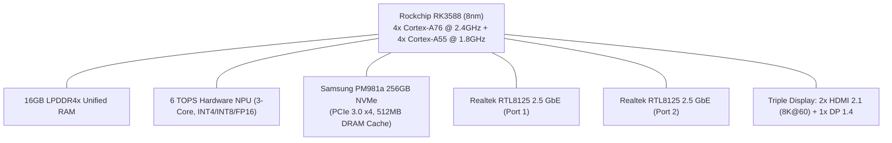
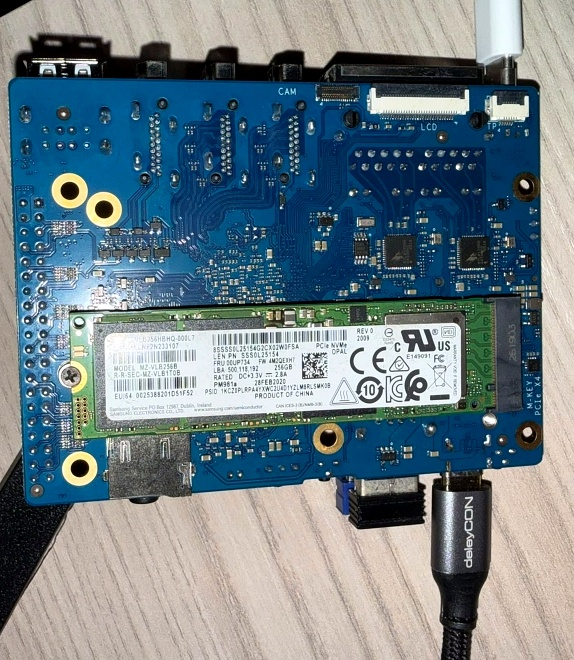
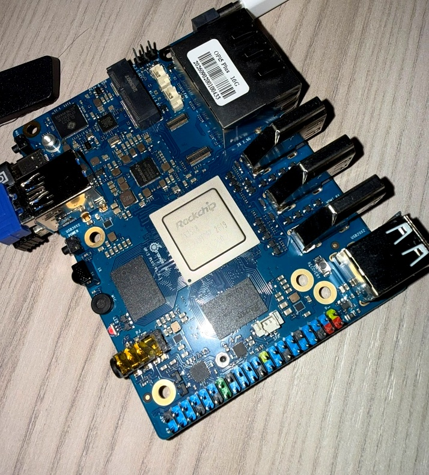
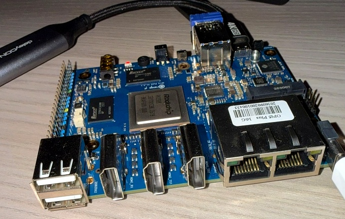

# Orange Pi 5 Plus: Homelab, Storage & Local AI Benchmark Suite

## Overview

This repository contains empirical benchmark results, hardware diagnostics, and automated test scripts for the **Orange Pi 5 Plus (16GB RAM)** paired with a **Samsung PM981a 256GB NVMe SSD** (Samsung Phoenix controller with 512MB dedicated DDR4 DRAM cache).

Conducted by **Pierluigi De Vitis**, this test suite evaluates the board for:
* **24/7 Homelab & Edge Servers** (Docker, microservices, database transactions)
* **High-Throughput NVMe Storage** (FIO Direct I/O saturation on PCIe 3.0 x4)
* **High-Speed Networking** (Dual 2.5 GbE Realtek RTL8125 controllers)
* **Local AI & Edge Inference** (Ollama ARM64 on CPU + Rockchip RKNPU2 / RKLLM 6 TOPS NPU)

---

## Hardware Specifications



* **Board:** Orange Pi 5 Plus
* **SoC:** Rockchip RK3588 (8-Core: 4x Cortex-A76 @ 2.26–2.40 GHz + 4x Cortex-A55 @ 1.80 GHz)
* **RAM:** 16GB LPDDR4x (16,347,128 kB total) + 7.8GB zram swap
* **Storage:** Samsung PM981a 256GB M.2 2280 NVMe SSD (Negotiated link: PCIe 3.0 x4 @ 8.0 GT/s)
* **Networking:** 2x Realtek RTL8125 2.5 GbE Ethernet (`enP4p65s0`, `enP3p49s0`) + Wi-Fi
* **NPU:** 3-core Rockchip NPU, 6 TOPS peak (Driver 0.9.8, RKLLM runtime 1.1.4)
* **Cooling Setup:** **Bare Board / Die** (Tested in standard standalone retail configuration. The default package from Orange Pi contains the board only, as cooling accessories are sold separately; all tests reflect out-of-the-box bare-die performance).
* **OS & Kernel:** Ubuntu 22.04.5 LTS (Jammy Jellyfish ARM64), Kernel 6.1.99-rockchip-rk3588

### Test Unit Gallery
| Bottom: Samsung PM981a NVMe (PCIe 3.0 x4) | Top: Rockchip RK3588 SoC & Unified RAM | Side: Dual 2.5GbE & Triple Display I/O |
| :---: | :---: | :---: |
|  |  |  |

> **Memory & VRAM Architecture Note:** Unlike traditional x86 mini PCs with fixed BIOS VRAM apertures, the RK3588 utilizes a unified 16GB LPDDR4x architecture dynamically managed via Linux kernel CMA (Contiguous Memory Allocator). Both CPU and NPU access the unified 16GB address space seamlessly.

---

## Benchmark Results Summary

### 1. Storage Performance (Samsung PM981a 256GB NVMe via FIO)
*All tests conducted using Direct I/O (`direct=1`, `ioengine=libaio`) to bypass Linux page cache.*

| Metric | Profile | Measured Result | Evaluation |
| :--- | :--- | :--- | :--- |
| **Sequential Read** | 1MB, QD32, 4GB | **2,862.33 MB/s** | Saturates ~92% of PCIe 3.0 x4 bus |
| **Sequential Write** | 1MB, QD32, 4GB | **2,172.94 MB/s** | Maximum sustained TLC write speed |
| **Random 4K Read** | 4K, QD32, Direct I/O | **197,108 IOPS** (~770 MB/s) | Outstanding index & database speed |
| **Random 4K Write** | 4K, QD32, Direct I/O | **153,771 IOPS** (~600 MB/s) | Rock-solid thanks to 512MB DRAM cache |
| **Mixed 70/30 R/W** | 4K, QD16, Direct I/O | **69,771 R / 29,930 W IOPS** | Simulates concurrent container loads |

### 2. CPU & Compute Performance
* **7-Zip Compression / Decompression:**
  * **Single-Core (1 Thread):** `2,831 MIPS`
  * **Multi-Core (8 Threads):** `13,015 MIPS`
* **Sysbench CPU (8 Threads, prime=20,000):** `4,343.94 events/sec`
* **Kernel Network Stack Loopback (iperf3 in-memory):** `47.5 Gbps` (verifies kernel TCP processing headroom; physical networking handled by two independent PCIe Realtek RTL8125 2.5 GbE ports)

### 3. Thermals & Cooling Stability (Bare-Die / Uncooled Assessment)
*All thermal data recorded on the naked board resting horizontally on an open desk with zero external heatsink or fan airflow:*
* **Baseline Idle (Open Desk):** `52.7°C` (impressive passive PCB dissipation for an 8-core SoC)
* **After Sustained FIO NVMe Storage Stress:** `62.8°C` (Samsung PM981a drive reached 45°C via SMART)
* **Under 1B–3B Local AI Inference (4T Big Cores):** `72.0°C – 79.5°C`
* **Peak Under 100% 8-Core Stress (`stress-ng`) & 8B LLM:** `78.5°C – 85.0°C` (SoC reaches the 85°C DVFS thermal threshold)
* *Key Buyer Takeaway:* In line with SBC industry standards, the standard retail package from Orange Pi contains the standalone board only (cooling solutions, cases, and power adapters are sold separately as optional add-ons or bundle kits). While light workloads, container hosting, and storage I/O remain stable bare-die thanks to copper plane dissipation, adding a dedicated heatsink or fan is strongly recommended for sustained 24/7 heavy CPU or AI workloads.

### 4. Local AI & LLM Inference Performance (Ollama ARM64)
*Inference run over standardized technical prompt (~256 generated tokens). Comparing full 8-thread allocation vs 4-thread Cortex-A76 Big-core pinning.*

| Model | Parameters | Thread Allocation | Eval (Generation) Rate | Prompt Processing Rate | TTFT (Time to First Token) | Memory Footprint (RSS) |
| :--- | :--- | :--- | :--- | :--- | :--- | :--- |
| **Llama 3.2: 1B** | 1.23B (Q4_K_M) | **Big Cores Only (4T)** | **14.62 tok/s** | **108.11 tok/s** | **425.5 ms** | ~1.3 GB |
| **Llama 3.2: 1B** | 1.23B (Q4_K_M) | All Cores (8T) | 10.67 tok/s | 79.91 tok/s | 575.6 ms | ~1.3 GB |
| **DeepSeek-Coder: 1.3B** | 1.35B (Q4_0) | **Big Cores Only (4T)** | **16.90 tok/s** | **89.72 tok/s** | **1,025.5 ms** | ~1.4 GB |
| **DeepSeek-Coder: 1.3B** | 1.35B (Q4_0) | All Cores (8T) | 4.52 tok/s | 27.91 tok/s | 3,295.7 ms | ~1.4 GB |
| **Qwen 2.5: 1.5B** | 1.54B (Q4_K_M) | **Big Cores Only (4T)** | **14.48 tok/s** | **70.24 tok/s** | **711.8 ms** | ~1.6 GB |
| **Qwen 2.5: 1.5B** | 1.54B (Q4_K_M) | All Cores (8T) | 3.46 tok/s | 42.33 tok/s | 1,181.2 ms | ~1.6 GB |
| **Llama 3.2: 3B** | 3.21B (Q4_K_M) | **Big Cores Only (4T)** | **7.28 tok/s** | **28.13 tok/s** | **1,635.2 ms** | ~2.8 GB |
| **Llama 3.2: 3B** | 3.21B (Q4_K_M) | All Cores (8T) | 1.99 tok/s | 10.84 tok/s | 4,245.2 ms | ~2.8 GB |
| **Phi-3 Mini: 3.8B** | 3.82B (Q4_K_M) | **Big Cores Only (4T)** | **6.56 tok/s** | **35.17 tok/s** | **909.8 ms** | ~3.1 GB |
| **Phi-3 Mini: 3.8B** | 3.82B (Q4_K_M) | All Cores (8T) | 5.27 tok/s | 32.97 tok/s | 970.5 ms | ~3.1 GB |
| **Llama 3.1: 8B** | 8.03B (Q4_K_M) | **Big Cores Only (4T)** | **2.32 tok/s** | **10.24 tok/s** | **3,028.3 ms** | ~5.4 GB |
| **Llama 3.1: 8B** | 8.03B (Q4_K_M) | All Cores (8T) | 2.10 tok/s | 7.66 tok/s | 4,044.8 ms | ~5.4 GB |

> **Key Architectural Finding:** Setting `num_thread=4` to isolate execution to the 4 Big Cortex-A76 cores eliminates inter-cluster synchronization stalls with the slower Cortex-A55 cores, yielding a **+37% boost on Llama 3.2 1B**, **+274% boost on DeepSeek-Coder 1.3B**, **+265% boost on Llama 3.2 3B**, and **+318% (4.18x) boost on Qwen 2.5 1.5B**!
> **The 8B Torture Test:** 16GB RAM allows running Llama 3.1 8B comfortably with 7.2GB free RAM, but token generation is memory-bandwidth bound to ~2.32 tok/s at 84-85°C.

---

### 5. Hardware NPU Inference (Rockchip RKLLM Native Runtime)
*The RK3588 features a 3-core 6 TOPS NPU. Ollama does NOT utilize this NPU; it runs 100% on the CPU. To benchmark the NPU, we compiled a native C++ runner against `librkllmrt.so`.*

#### On-Device Empirical NPU Test:
| Model | Format / Runtime | NPU Cores | Eval (Generation) Rate | TTFT (Latency) | System CPU Load |
| :--- | :--- | :--- | :--- | :--- | :--- |
| **Qwen 1.5: 0.5B** *(Measured)* | INT8/INT4 (`.rkllm`) | 3 Cores (Full NPU) | **21.55 tok/s** | **96.4 ms** | **~0% (Completely Offloaded)** |

#### Head-to-Head: CPU vs Hardware NPU (Measured & Vendor/Community Reference)
| Parameter Class | Ollama CPU (Big Cores 4T - Measured) | Rockchip NPU (6 TOPS, 3 Cores) | Status / Advantage |
| :--- | :--- | :--- | :--- |
| **0.5B - 1.0B** | 14.62 tok/s (Llama 3.2 1B) | **21.55 tok/s** (Qwen 1.5 0.5B) | **Measured on-device**: +47% faster, TTFT 96ms vs 425ms |
| **1.3B - 1.5B** | 16.90 tok/s (DeepSeek) / 14.48 (Qwen) | **~16.69 tok/s** (Qwen 2.5 1.5B NPU) | *Reference Data*: Equivalent throughput, **0% CPU load** |
| **3B - 4B** | 6.56 tok/s (Phi-3) / 7.28 (Llama 3.2) | **~7.45 tok/s** (Phi-3 3.8B NPU) | *Reference Data*: Equivalent throughput, zero CPU load |
| **7B - 8B** | **2.32 tok/s** (Llama 3.1 8B) | **~4.5 - 4.98 tok/s** (6B/7B NPU) | *Reference Data*: ~2x faster, avoids 85°C CPU heating |

---

## How to Reproduce These Benchmarks

You can run the exact same tests on your Orange Pi 5 Plus or any Rockchip RK3588 board:

### 1. Clone this Repository
```bash
git clone https://github.com/Pigi998/orangepi-5plus-benchmarks.git
cd orangepi-5plus-benchmarks
```

### 2. Install Required Dependencies
```bash
sudo apt update && sudo apt install -y \
  build-essential curl wget git \
  p7zip-full fio iperf3 lm-sensors \
  stress-ng htop nvme-cli smartmontools sysbench jq python3-psutil
```

### 3. Run the Unified Benchmark Script (Storage, CPU, Network, Thermals)
```bash
chmod +x tools/run_homelab_bench.sh
./tools/run_homelab_bench.sh
```

### 4. Run the Local LLM CPU Benchmark (Ollama)
```bash
chmod +x tools/benchmark_ollama.py
python3 tools/benchmark_ollama.py llama3.2:1b llama3.2:3b qwen2.5:1.5b llama3.1:8b
```

### 5. Run the Hardware NPU Benchmark (RKLLM)
```bash
chmod +x tools/benchmark_npu.py
python3 tools/benchmark_npu.py tools/qwen1.5-0.5B.rkllm
```

---

## Official Hardware & Purchase Links

Direct links to the official manufacturer stores:

* **Official Portal:** [Orange Pi](http://www.orangepi.org/)
* **Orange Pi 5 Plus Details:** [Technical Specifications](http://www.orangepi.org/html/hardWare/computerAndMicrocontrollers/details/Orange-Pi-5-plus.html)
* **Official AliExpress Store:** [Orange Pi Official Store](https://www.aliexpress.com/store/1553371)
* **Official Amazon Store:** [Orange Pi 5 Plus on Amazon](https://www.amazon.com/dp/B0C5C2CDGX)

---

## License

All benchmark scripts and collected dataset files in this repository are released under the [MIT License](LICENSE). Feel free to adapt and incorporate them into community comparisons.
